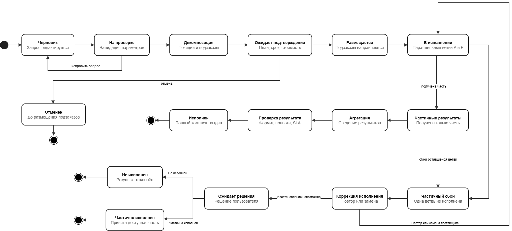

# Оркестрация консолидированного заказа

Раздел описывает аналитическую модель ядра системы, которая принимает единый пользовательский запрос, декомпозирует его на позиции и подзаказы минимум двум поставщикам, координирует асинхронное исполнение, обрабатывает частичные сбои и агрегирует результаты.

## Что находится в разделе

| № | Файл | Содержание |
|---:|---|---|
| 1 | [01_process_description.md](01_process_description.md) | Процесс со стороны пользователя, системы и поставщиков |
| 2 | [02_functional_areas.md](02_functional_areas.md) | Функциональные области ядра оркестрации |
| 3 | [03_functional_requirements.md](03_functional_requirements.md) | 41 функциональное требование `ORC-001–ORC-041` |
| 4 | [04_non_functional_requirements.md](04_non_functional_requirements.md) | 47 нефункциональных требований `NFR-001–NFR-047` |
| 5 | [05_order_state_diagram.drawio](05_order_state_diagram.drawio) | Редактируемая диаграмма состояний |
|   | [05_order_state_diagram.png](05_order_state_diagram.png) | Превью диаграммы состояний |
|   | [05_order_state_diagram.svg](05_order_state_diagram.svg) | Векторная версия диаграммы состояний |
| 6 | [06_normal_execution.bpmn](06_normal_execution.bpmn) | BPMN штатного исполнения |
|   | [06_normal_execution.png](06_normal_execution.png) | Превью штатного исполнения |
| 7 | [07_partial_supplier_failure.bpmn](07_partial_supplier_failure.bpmn) | BPMN частичного сбоя поставщика |
|   | [07_partial_supplier_failure.png](07_partial_supplier_failure.png) | Превью частичного сбоя |
| 8 | [08_traceability_matrix.md](08_traceability_matrix.md) | Матрица трассировки требований и 37 сценариев проверки |
| 9 | [09_business_rules.md](09_business_rules.md) | Таблицы решений для ключевых бизнес-правил |
| 10 | [10_gias_recomendation.md](10_gias_recomendation.md) | 18 предложений для ГИАС РКД |

## Границы модели

Консолидированный заказ представляет единый запрос пользователя, исполнение которого требует нескольких связанных результатов от двух или более поставщиков.

В область модели входят:

- формирование и проверка запроса;
- декомпозиция на позиции и подзаказы;
- выбор поставщиков и планирование;
- подтверждение и размещение;
- параллельное и зависимое исполнение;
- асинхронное получение статусов и результатов;
- контроль сроков и тайм-аутов;
- проверка и количественный учёт результатов;
- повторное исполнение и замена поставщика;
- принятие решения по частичному результату;
- агрегация и формирование итогового статуса;
- уведомления и аудит.

## Участники

| Участник | Ответственность |
|---|---|
| Пользователь | Формирует и подтверждает запрос, наблюдает за исполнением, принимает решение при изменении условий или частичном результате |
| Система-агрегатор | Проверяет, декомпозирует, размещает, координирует, учитывает объёмы, применяет правила и агрегирует результаты |
| Поставщик A | Принимает подзаказ, сообщает статус и передаёт результат или ошибку |
| Поставщик B / замещающий поставщик | Исполняет вторую ветвь либо получает замещающий подзаказ после сбоя |

## Жизненный цикл заказа

| Состояние | Назначение |
|---|---|
| **Черновик** | Пользователь редактирует запрос |
| **На проверке** | Система проверяет обязательные параметры и ограничения |
| **Декомпозиция** | Формируются позиции, подзаказы, зависимости и плановые объёмы |
| **Ожидает подтверждения** | Пользователь проверяет состав, сроки, стоимость и условия |
| **Размещается** | Подзаказы направляются поставщикам |
| **В исполнении** | Поставщики выполняют подзаказы, система контролирует статусы и сроки |
| **Частичные результаты** | Получена только часть обязательных результатов |
| **Частичный сбой** | Одна ветвь завершилась ошибкой или тайм-аутом; успешные результаты сохраняются |
| **Коррекция исполнения** | Выполняется повтор, замена поставщика или иное допустимое действие |
| **Ожидает решения** | Требуется решение пользователя или оператора |
| **Агрегация** | Принятые результаты объединяются в единый комплект |
| **Проверка результата** | Проверяются полнота, формат и соответствие условиям |
| **Исполнен** | Приняты все обязательные результаты или допустимые замены |
| **Частично исполнен** | Разрешён и принят неполный комплект |
| **Не исполнен** | Обязательный результат не получен, коррекция исчерпана |
| **Отменён** | Заказ остановлен до необратимого размещения |

## Штатное исполнение

1. Пользователь формирует единый запрос.
2. Система проверяет параметры и возвращает ошибки для исправления.
3. Корректный запрос декомпозируется на позиции и подзаказы.
4. Система применяет правила выбора поставщиков, приоритетов и ресурсов.
5. Пользователь подтверждает рассчитанные условия.
6. Подзаказы A и B размещаются и исполняются параллельно.
7. Результаты поступают асинхронно и связываются с нужными подзаказами.
8. Система проверяет формат, целостность и условия исполнения.
9. Принятые фактические объёмы фиксируются без двойного учёта.
10. Результаты, метаданные и отчёт объединяются в единый комплект.
11. Пользователь получает комплект, а заказ — статус **«Исполнен»**.

[Открыть BPMN](06_normal_execution.bpmn) · [Посмотреть PNG](06_normal_execution.png)

## Частичный сбой поставщика

Сценарий показывает ситуацию, когда результат A получен и сохранён, а ветвь B завершилась ошибкой или тайм-аутом.

1. Система сохраняет успешный результат A.
2. Для B фиксируются причина, затронутый объём и нарушение условий.
3. Заказ получает промежуточное состояние **«Частичный сбой»**.
4. По бизнес-правилам выбирается повтор, замена, уточнение или решение пользователя.
5. Замещающий результат учитывается вместо неуспешной попытки.
6. Если восстановление невозможно, пользователь принимает или отклоняет частичный комплект.
7. Заказ получает итоговое состояние **«Исполнен»**, **«Частично исполнен»** или **«Не исполнен»**.

[Открыть BPMN](07_partial_supplier_failure.bpmn) · [Посмотреть PNG](07_partial_supplier_failure.png)

## Требования и проверка покрытия

Функциональные требования разделены на девять областей:

1. управление консолидированным заказом;
2. декомпозиция запроса;
3. формирование и исполнение подзаказов;
4. асинхронное взаимодействие;
5. координация и проверка результатов;
6. количественный учёт и агрегация;
7. обработка исключений и коррекция;
8. бизнес-правила и управление приоритетами;
9. уведомления и аудит.

[Матрица трассировки](08_traceability_matrix.md) связывает каждое требование `ORC-001–ORC-041` с:

- этапом процесса;
- конкретным элементом BPMN или системной функцией;
- сценарием проверки `TC-001–TC-037`;
- ожидаемым результатом проверки.

Это позволяет показать, что требования отражены в моделях и могут быть проверены на макете.

## Бизнес-правила

В [09_business_rules.md](09_business_rules.md) формализованы четыре группы решений:

| Правило | Назначение |
|---|---|
| `BR-01` | Выбор действия при ошибке, тайм-ауте или исчерпании повторов |
| `BR-02` | Отбор и ранжирование поставщиков |
| `BR-03` | Проверка и приёмка результата |
| `BR-04` | Определение итогового состояния заказа |

Значения весов, лимитов повторов, интервалов и тайм-аутов являются предложениями для макета и требуют согласования.

## Предложения для ГИАС РКД

В [10_gias_recomendation.md](10_gias_recomendation.md) сформулировано 18 предложений. Основные из них:

- единая форма заказа с картой, периодом и продуктом;
- стабильный API и подключаемые адаптеры поставщиков;
- единая модель статусов;
- очередь событий и асинхронная обработка;
- сохранение успешных результатов при сбое отдельной ветви;
- идемпотентная обработка событий и количественный журнал;
- версионируемые и объяснимые бизнес-правила;
- формальное управление приоритетами;
- повторное подтверждение при изменении цены, срока или состава;
- проверка EULA и ограничений использования;
- единый комплект результатов с описью и отчётом;
- показатели SLA и качества поставщиков.

## Соответствие пункту 3.2.2.3 ТЗ

| Требование ТЗ | Реализация в материалах |
|---|---|
| Подзадачи и декомпозиция | `ORC-004–ORC-007`, обе BPMN |
| Асинхронное исполнение | `ORC-014–ORC-017`, события сообщений и тайм-аут |
| Координация | `ORC-018–ORC-019`, параллельные шлюзы и зависимости |
| Исключительные ситуации | `ORC-029–ORC-037`, BPMN частичного сбоя |
| Корректирующие действия | `BR-01`, повтор, замена и решение пользователя |
| Количественный учёт | `ORC-023–ORC-027`, фиксация плановых и фактических объёмов |
| Формализованные правила | `ORC-038–ORC-040`, `BR-01–BR-04` |
| Консолидированность | Родительский заказ, позиции, подзаказы и единый результат |
| Агрегация результатов | `ORC-028`, задача агрегации и итоговый комплект |